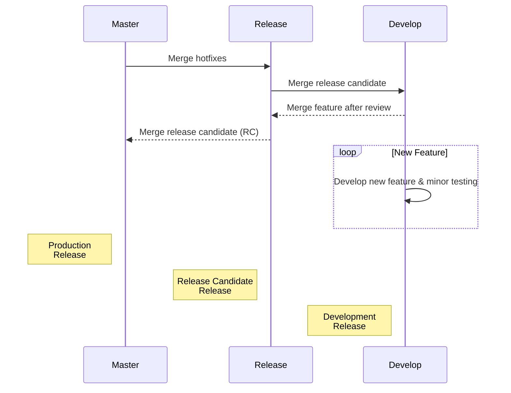

<p align="center">
  <a href="https://insurerity.com/" target="blank"></a>
</p>

# <u>Insurerity NIC CCMS CLIENT</u>

> [!IMPORTANT]
> The entire UI of all the components is dependent on TailwindCSS

###



### Step for implementing features

- Create a new branch using the [Git Flow](https://www.atlassian.com/git/tutorials/comparing-workflows/gitflow-workflow) guidelines
- After a code review of your components/ui implementations the branch will be merged accordingly

### Steps for utilizing git flow

- Make sure you have the git cli installed for your operating system

- Use the git flow cheatsheet here [git-flow cheatsheet](https://danielkummer.github.io/git-flow-cheatsheet/)

### Commit format

- Commits in this repository are made using the [Conventional Commits ](https://www.conventionalcommits.org/en/v1.0.0/)guidelines
- > [!TIP]
  > It is not always necessary to specify scope when creating commits, but it is recommended to help pinpoint exactly which part of the codebase has been modified
- When making a commit relating to a particular scope, use;
  - feat(scope) For new features/components
  - refactor(scope) For changes to the codebase that neither fixes a bug nor adds a feature (eg. variable name change, converting a named function to an arrow function)
  - docs(scope) For adding inline documentation to components
  - fix(scope) For when fixes have application bugsbeen made to
  - chore(scope) Tasks which cause no changes in production code
  - test(scope) For writing test cases for a scope
  - perf(scope) For optimization or performance improvements in a scope
  - docs(scope) For documentation related changes
  - style(scope) For code related to styling (eg. adding custom css classes, modifiers, etc.)
- Scopes may include;
  - **component**: For ui components
  - **ui**: For page templates, and minor ui changes in molecules or organisms
  - **types**: For custom typescript types, interfaces, etc
  - **lib**: For helper functions utilized by components and other things
  - **exports** For adding module, function, component, etc. exports
  - **workflows** For adding github workflows
  - **deps** For adding modifying dependencies

### Component documentation guidelines

It is very essential to write documentation for component props, as it would help in the future when we are porting the components into a standalone library. The format used should be as follows;

```typescript
/**
 * @property {Name of the property}
 * @type {The datatype of the property}
 * @default {The default value (if it takes any)}
 * @deprecated {Whether the property is deprecated (No additional text required)}
 * @optional {Whether the property is optional (No additional text required)}
 * @description {Brief description of the property}
 * @example {Brief example demonstrating how to use the property}
 * @renders {The resulting jsx which is rendered. Do not add this if the jsx renderd is deeply nested and complicated. Use this for only simple components like pills, alerts, spinners, etc}
 */
```

### Code guidelines

- Code Style Guide

  - Always use arrow functions

  - Always use camelCase in variable naming

  - Use **const** always when naming variables, unless it will be reassigned, then use **let**. Never use var

  - Use the formatting style specified in the `.prettierrc` file

  - Always use functional components except when building HOCs

  - Always write documentation explaining any custom functions you write. The below shows an example for how documentation should look for a function;

    ```javascript
    /**
     * @description This function is used to check whether all the keys in an array are present in the object
     * @param {Array} keys
     * @param {Object} object
     * @returns {Boolean}
     * @author Joshua Akangah
     */
    export const doKeysExist = (
      keys: Array<string>,
      object: Object
    ): boolean => {
      return keys.every((key) => object.hasOwnProperty(key));
    };
    ```

- You can also write documentation within the function if more complex functionality is being done there - use your own discretion here.

- You can find more ways to document other constructs like objects, types, etc here: [Documenting JavaScript Code With JSDocs | Engineering Education (EngEd) Program | Section](https://www.section.io/engineering-education/jsdoc-documentation/)

- This codebase is to be written in Typescript exclusively, and Javascript where necessary. Follow the [Google TypeScript Guide](https://google.github.io/styleguide/tsguide.html) to ensure uniformity in the codebase

> [!IMPORTANT]
> Be sure to indicate where you have made breaking changes to any section of the application code.

> [!IMPORTANT]
> If you introduce breaking changes to a component which cannot be implemented throughout the codebase promptly, move the legacy component into a `legacy` directory within that component's directory, and use a named import to import the new component.

### Strict adherence

**The following rules must be followed judiciously, any pull requests which do not conform to these rules would not be subject to approval and hence rejected.**

- All commits must conform to the conventional commit guideline. A link has been provided in the above to how to write commits in that format. For simplification purposes, the format is;

  ```
  <commit_type!>(<scope?>): <commit_message!>
  ```

  - Where `!` signifies required parameters and `?` signifies optional ones
  - Use smaller case throughout your commit messages, use snake case if need be
  - Always leave a space after the colon
  - Your commit message should be short and precise, and shouldn't be more than 80 characters. If there is a need for a longer commit message, add it to the commit description

- Always use smaller case and snake case when naming branches, never use a single capital letter when naming a branch.

- Always use the specified `.prettierrc` file in the codebase for formatting.

- Always request a code review from the project lead when making a pull request, never merge a pull request without review or express permission from the project lead.

- Always consult with the project lead and seek approval before incorporating the use of a specific package/library in the codebase.

- Avoid the use of native JSX tags in the codebase, use the created atomic components instead, unless there isn't a corresponding component for that tag, or there isn't an implemented functionality for that component.

### Bug/Error reporting

In the event of a bug, the following is a specific format which should be used for reporting bugs on the ClickUp page. [Central Dashboard ClickUp Page](<https://app.clickup.com/2617020/v/li/174467900https://app.clickup.com/2617020/v/li/174467900[ClickUp](https://app.clickup.com/2617020/v/li/174467900https://app.clickup.com/2617020/v/li/174467900)>)

- Provide an appropriate title to the error which describes the error in short words.
- Provide a detailed description of the error, the actions/steps you took before the error occured, and how to reproduce that error/bug.
- Provide screenshots/error messages where necessary. If the bug is UI related, a screenshot should be provided, any other errors which provide error messages should include a screenshot or text of that specific error message.
- The browser and device on which the error occured.

### Features

Developer experience first:

- ⚡ [Next.js](https://nextjs.org) for Static Site Generator
- 🔥 Type checking [TypeScript](https://www.typescriptlang.org)
- 💎 Integrate with [Tailwind CSS](https://tailwindcss.com)
- ✅ Strict Mode for TypeScript and React 18
- 📏 Linter with [ESLint](https://eslint.org) (default NextJS, NextJS Core Web Vitals, Tailwind CSS and Airbnb configuration)
- 💖 Code Formatter with [Prettier](https://prettier.io)
- 🦊 Husky for Git Hooks
- 🚫 Lint-staged for running linters on Git staged files
- 🚓 Lint git commit with Commitlint
- 🦺 Unit Testing with Jest and React Testing Library
- 🧪 E2E Testing with Cypress
- 💡 Absolute Imports using `@` prefix
- 🗂 VSCode configuration: Debug, Settings, Tasks and extension for PostCSS, ESLint, Prettier, TypeScript, Jest
- 🤖 SEO metadata, JSON-LD and Open Graph tags with Next SEO
- ⚙️ [Bundler Analyzer](https://www.npmjs.com/package/@next/bundle-analyzer)
- 🖱️ One click deployment with Vercel or Netlify (or manual deployment to any hosting services)
- 🌈 Include a FREE minimalist theme
- 💯 Maximize lighthouse score

Built-in feature from Next.js:

- ☕ Minify HTML & CSS
- 💨 Live reload
- ✅ Cache busting

### Philosophy

- Minimal code
- SEO-friendly
- 🚀 Production-ready

### Nextless.js SaaS Boilerplate

Build your SaaS product faster with [React SaaS Boilerplate](https://nextlessjs.com).

[](https://nextlessjs.com)

### Premium Themes

| [Green Nextjs Landing Page Template](https://creativedesignsguru.com/landing-green-modern-nextjs-theme/)                                                                                                   | [Purple Saas Nextjs Theme](https://creativedesignsguru.com/landing-purple-modern-react-theme/)                                                                                                      |
| ---------------------------------------------------------------------------------------------------------------------------------------------------------------------------------------------------------- | --------------------------------------------------------------------------------------------------------------------------------------------------------------------------------------------------- |
| [](https://creativedesignsguru.com/landing-green-modern-nextjs-theme/) | [](https://creativedesignsguru.com/landing-blue-modern-react-theme/) |

Find more [Nextjs Themes](https://creativedesignsguru.com/category/nextjs/).

### Requirements

- Node.js 14+ and npm

### Getting started

Run the following command on your local environment:

```shell
git clone --depth=1 https://github.com/ixartz/Next-js-Boilerplate.git my-project-name
cd my-project-name
npm install
```

Then, you can run locally in development mode with live reload:

```shell
npm run dev
```

Open http://localhost:3000 with your favorite browser to see your project.

```shell
.
├── README.md                       # README file
├── __mocks__                       # Mocks for testing
├── .github                         # GitHub folder
├── .husky                          # Husky configuration
├── .vscode                         # VSCode configuration
├── public                          # Public assets folder
├── src
│   ├── layouts                     # Layouts components
│   ├── pages                       # Next JS Pages
│   ├── pages.test                  # Next JS Pages tests (this avoid test to treated as a Next.js pages)
│   ├── styles                      # Styles folder
│   ├── templates                   # Default template
│   └── utils                       # Utility functions
├── tailwind.config.js              # Tailwind CSS configuration
└── tsconfig.json                   # TypeScript configuration
```

### Customization

You can easily configure Next js Boilerplate. Please change the following file:

- `public/apple-touch-icon.png`, `public/favicon.ico`, `public/favicon-16x16.png` and `public/favicon-32x32.png`: your website favicon, you can generate from https://favicon.io/favicon-converter/
- `src/styles/global.css`: your CSS file using Tailwind CSS
- `src/utils/AppConfig.ts`: configuration file
- `src/templates/Main.tsx`: default theme

### Deploy to production

You can see the results locally in production mode with:

```shell
$ npm run build
$ npm run start
```

The generated HTML and CSS files are minified (built-in feature from Next js). It will also removed unused CSS from [Tailwind CSS](https://tailwindcss.com).

You can create an optimized production build with:

```shell
npm run build-prod
```

Now, your blog is ready to be deployed. All generated files are located at `out` folder, which you can deploy with any hosting service.

### Testing

All tests are colocated with the source code inside the same directory. So, it makes it easier to find them. Unfortunately, it is not possible with the `pages` folder which is used by Next.js for routing. So, what is why we have a `pages.test` folder to write tests from files located in `pages` folder.

### Deploy to Netlify

Clone this repository on own GitHub account and deploy to Netlify:

[](https://app.netlify.com/start/deploy?repository=https://github.com/ixartz/Next-js-Boilerplate)

### Deploy to Vercel

Deploy this Next JS Boilerplate on Vercel in one click:

[](https://vercel.com/new/git/external?repository-url=https%3A%2F%2Fgithub.com%2Fixartz%2FNext-js-Boilerplate)

### VSCode information (optional)

If you are VSCode users, you can have a better integration with VSCode by installing the suggested extension in `.vscode/extension.json`. The starter code comes up with Settings for a seamless integration with VSCode. The Debug configuration is also provided for frontend and backend debugging experience.

With the plugins installed on your VSCode, ESLint and Prettier can automatically fix the code and show you the errors. Same goes for testing, you can install VSCode Jest extension to automatically run your tests and it also show the code coverage in context.

Pro tips: if you need a project wide type checking with TypeScript, you can run a build with <kbd>Cmd</kbd> + <kbd>Shift</kbd> + <kbd>B</kbd> on Mac.

### Contributions

Everyone is welcome to contribute to this project. Feel free to open an issue if you have question or found a bug.

### License

Licensed under the MIT License, Copyright © 2022

See [LICENSE](LICENSE) for more information.

---

Made with ♥ by [CreativeDesignsGuru](https://creativedesignsguru.com) [](https://twitter.com/ixartz)

[](https://nextlessjs.com)
